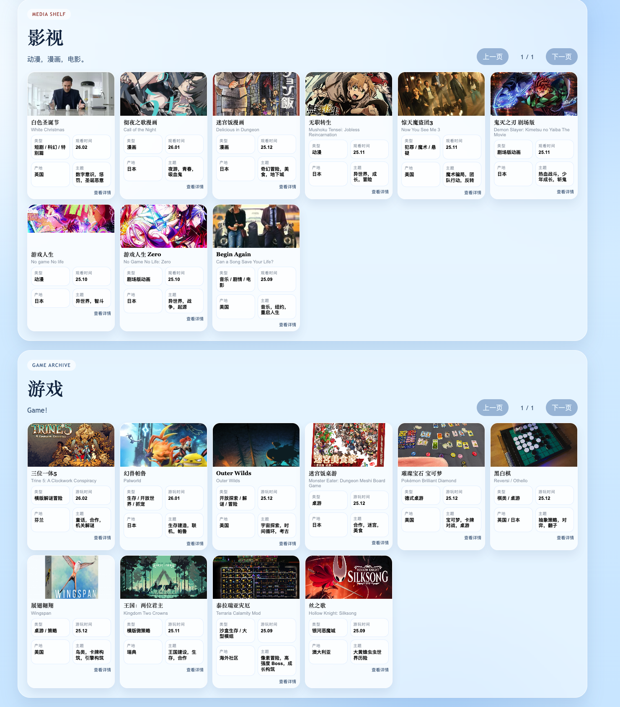
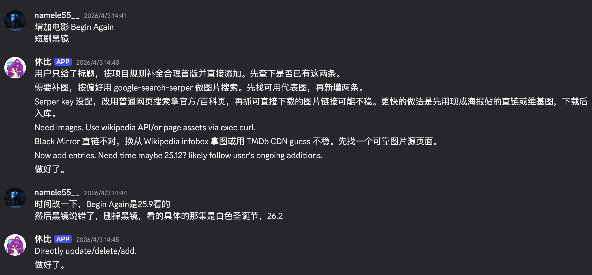
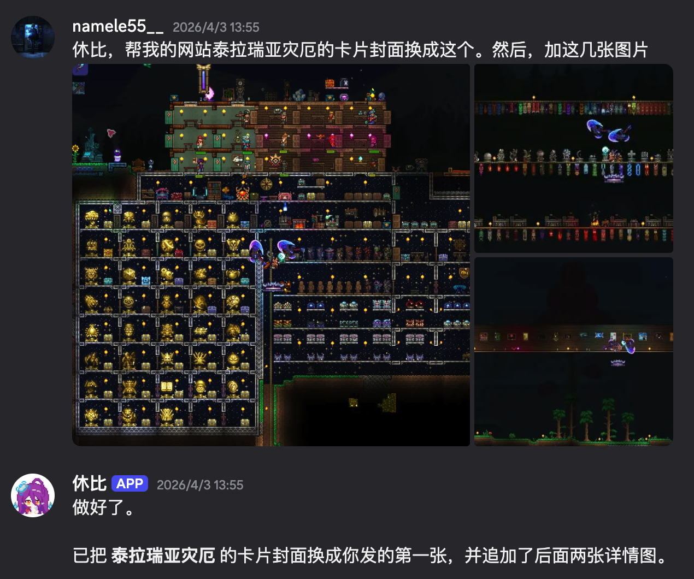

# Agent 代理操作个人收藏网站 Demo

<p>
  <a href="./README.en.md">
    
  </a>
</p>

一个把 agent 接到个人网站里的小案例，全程vibe coding。

步骤：
1. 跟codex说明个人影视收藏网站需求，写前后端，写增删改查操作的readme。
2. 让discord上的agent阅读该网站。
3. 和discord上的agent验证操作，没问题后写入skills.md
4. 在discord上通过与agent聊天长期维护影视网站。

现在这个仓库整理的是它的公开 demo 版本。

## What It Does

这个 demo 展示的是一条很具体的链路：

- 网站本身是一个可维护的个人收藏站，有影视、游戏、旅游三栏，支持卡片缩略图、详情弹层、分页和图片画廊。
- 可以直接在 Discord 里给 agent 发自然语言消息，让它去新增条目、修改字段、替换封面、追加详情图、删除条目等。也可以只发个名字，agent自己搜索简介，类型，封面图。
- agent 完成操作后，结果会真正落到网站上。
- 图片类操作也在这条链路里：比如我把几张图发到 Discord，agent 会把它们当成封面或详情图写进网站数据里。

README 里的三张图刚好对应这几个动作：

- 第一张是网站本体，展示最终被维护出来的页面长什么样。
- 第二，三张是真实操作的例子。

## Preview

网站本体：



通过聊天让 agent 替网站换封面、加详情图：



通过聊天直接做新增、修改、删除：



## How To Build It

步骤如下：

1. 先和 Codex 对话，把网站本身做出来。  
   最开始只是一个私人收藏站的想法，后来逐步明确成三栏结构、卡片布局、详情页、分页、图片画廊和网页端管理面板。

2. 再把网站的维护规则固定下来。  
   数据怎么存、图片放在哪里、封面怎么替换、详情图怎么追加、时间怎么排序、命令行怎么增删改查，都要先明确。

3. 然后让 OpenClaw 读懂这套规则。  
   让 agent 先理解这个网站的接口、数据结构和操作路径。

4. 接着在 Discord 里来回调试。  
   通过真实消息和图片附件去验证新增、修改、删除、换封面、追加详情图这些操作是不是都能正确落到网站上。
   同时确保可以扔给agent一个电影名，自动搜索布置封面图，简介等词条。核对清楚需求

5. 最后再把这套已经调通的流程沉淀成 skill。  
   这样后续维护这个站的时候，agent 走的是一套已经验证过的步骤。

## Skill

这个项目里有一个配套 skill，用来描述这个网站应该怎么被维护。

它主要包含这些信息：

- 什么时候该把请求识别为新增、修改、删除、换封面、加图
- 优先走哪些命令或接口
- 时间字段必须是 `YY.MM`
- 图片尽量用本地稳定资源，不要把脆弱外链写进仓库
- 改完之后要怎么快速验证结果

技能文件在这里：

- [skills/collection-site-maintainer/SKILL.md](./skills/collection-site-maintainer/SKILL.md)

如果你想看更细一点的接入说明：

- [docs/openclaw-integration.md](./docs/openclaw-integration.md)
- [examples/discord-prompts.md](./examples/discord-prompts.md)

## Quick Start

要求：

- Node.js 22.16+，推荐 Node 24
- 不需要额外数据库服务

启动：

```bash
cd openclaw-collection-showcase
cd website
npm start
```

默认地址：

```text
http://127.0.0.1:4173
```

默认写接口密码：

```text
demo-password
```

也可以自己覆盖：

```bash
cd website
ADMIN_PASSWORD=your-own-password npm start
```

默认只监听本地 `127.0.0.1`。如果你要公开暴露，请先改密码。

## Project Structure

```text
website/
  public/
  data/
  scripts/
  package.json
  server.js
skills/
  collection-site-maintainer/
docs/
  *.png
  *.md
examples/
  discord-prompts.md
```

## Reuse Ideas

这个仓库很适合作为下面几类东西的起点：

- 一个能直接跑起来的个人收藏网站骨架
- 一个“agent 怎么接真实网站维护流程”的最小案例
- 一个把私人原型整理成公开 showcase 的参考
- 一个 OpenClaw skill 如何围绕具体项目落地的例子

真正可运行的网站代码现在都在 `website/` 目录里；仓库根目录更多负责说明、展示图、示例提示词和 skill 本身。
